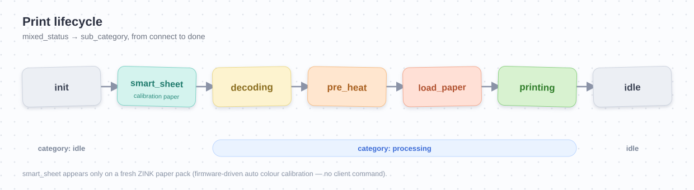

# Protocol notes

Reverse-engineered from iPhone Bluetooth captures of the Mi Home app talking to a Mi Portable
Photo Printer (`hannto.printer.basil`, model `XMKDDYJ01HM` / `XMKDDYJHT02`, made by Hannto) and
verified by driving real hardware. The frame format is shared with other Hannto printers (Xiaomi
Photo Printer Pro, Liene PixCut), so parts may transfer to those.

## Transport

- Bluetooth Classic. SDP advertises three RFCOMM channels:
  - **channel 1** - Serial Port Profile (SPP, UUID `00001101-...`). The one `mizink` uses; it
    speaks the full JSON-RPC + file protocol directly.
  - **channel 22** - Apple iAP2 (Made-for-iPhone). Same frames wrapped in an iAP2 EA session
    (`com.hannto.basil`); only relevant on iOS hosts. Not required.
  - **channel 23** - WeChat Mini-Program transport. A different protocol; stays silent to our
    frames. Unused.
- The printer drops an idle link after ~15 s; send anything (e.g. `mixed_status`) to keep it.
- If a connection suddenly fails to open on macOS, the stored pairing key is likely stale;
  re-pair (`blueutil --unpair <mac> && blueutil --pair <mac>`).

## Frame

Total length `22 + bodyLen`, little-endian fields:

| off | size | field |
|----:|-----:|-------|
| 0 | 1 | `0x7E` head |
| 1 | 1 | `0x64` version |
| 2 | 1 | `0x00` reserved |
| 3 | 1 | channel - `1` JSON, `2` file, `255` auth |
| 4 | 1 | interactive - `6` request, `7` response |
| 5 | 1 | encoding - `2` binary/hex, `3` json |
| 6 | 4 | arcMsgSn (0) |
| 10 | 4 | msgSn - per-side counter |
| 14 | 2 | packageTotal |
| 16 | 2 | packageNum (1-based) |
| 18 | 2 | msgAttribute = `bodyLen | (encType<<10) | (0x2000 if multi-package)` |
| 20 | N | body |
| 20+N | 1 | checksum = `(sum(all bytes, checksum & tail = 0) - 126) & 0xFF` |
| 21+N | 1 | `0x7E` tail |

`encType`: `0` none, `4` = **mijia** (what this model uses). The Pro model uses `5` (AES-ECB
after a Diffie-Hellman handshake); basil does **not** do DH - it uses a pre-provisioned token.

## Encryption

`encType 4` = **RC4**, key = the printer's 12-byte miio device token, with a **fresh key
schedule for every frame**. Consequences:

- The keystream is identical at the same offset in every frame, so one captured 928-byte
  keystream is equivalent to the token (see `tools/recover_keystream_from_pklg.py`).
- The raw token cannot be recovered from a keystream (RC4 KSA is not invertible), but it
  isn't needed to operate the printer.

## Commands (channel 1, JSON-RPC)

Bodies are `{"id":N,"method":...,"params":...}`, encrypted. Print flow:

```
-> clean_data   {"delay_times":0}
-> mixed_status []                         <- {category, sub_category, error, battery, ...}
-> get_prop     ["device_info"]            <- [{fw_ver, hw_ver, mac, sn_pcba, sku, did}]
-> print_job    {copies,channel:64,job_type:0,file_size}  <- {job_id}  (or {"error":{"code":-8006}} if busy)
   (channel 2, encoding 2: file streamed in frames of 4-byte LE job_id + up to 924 JPEG bytes,
    packageNum/packageTotal set, msgAttribute has the multi-package bit)
-> confirm_job  [job_id]                   <- ["OK"]
-> job_info     [job_id] (poll)            <- [{job_id, job_type, job_state, prt_copies,
                                               transfer_time, print_time, clients, did, fw_ver}]
   (or mixed_status [] poll)               category: idle -> processing (decoding, pre_heat,
                                           load_paper, printing) -> idle
<- event.big_data (unsolicited, on finish) {mijia:{"0":{finished}}, total:{finished,printed},
                                           TMD_code, did}
```

Image: baseline JPEG, **1040 × 1560 px**, standard Huffman tables. `job_type 0` = photo.

Notes:
- `clean_data` is sent by the Mi Home app before every `print_job`; mizink does the same.
- `job_info` gives an explicit `job_state:"finished"` - cleaner than watching `mixed_status`
  return to `idle`. `print_time`/`transfer_time` are milliseconds.
- `event.big_data.total.printed` is the printer's lifetime print counter.

### Status phases (`mixed_status` → `category` / `sub_category`)



A job walks through these `sub_category` values (observed across captures):

```
init        idle, no job
smart_sheet feeding the ZINK Smart Sheet (auto colour calibration on a fresh paper pack)
decoding    receiving/decoding the JPEG
pre_heat    warming the thermal head
load_paper  pulling a sheet
printing    printing
idle        done
```

`category` is `idle` between jobs and `processing` while a job runs.

**Calibration is not a command.** The ZINK Smart Sheet is run by the printer's firmware
before the first print of a new pack; the client only observes it as `sub_category:"smart_sheet"`.
No calibration command, coefficients, or profile is exchanged over Bluetooth.

## Getting the firmware and Mi Home plugin

Neither the device firmware nor the app protocol is documented, but both are
downloadable from Xiaomi's cloud by MIoT `model` alone. The printer does **not**
need to be online or even paired for these queries.

All calls go to the regional MIoT API host `https://{region}.api.io.mi.com/app`
(`region` in `cn`, `de`, `us`, `ru`, `sg`, `i2`, …; the printer's firmware is served
from the "abroad" regions, so `de`/`sg`/`ru` return a URL while `cn` may 403). Each
request is signed with a logged-in Mi account session (the standard MIoT
nonce + `signed_nonce` HMAC/RC4 scheme). The easiest way to sign is to reuse
[`Xiaomi-cloud-tokens-extractor`](https://github.com/PiotrMachowski/Xiaomi-cloud-tokens-extractor)'s
`XiaomiCloudConnector` - log in once, then add the two calls below.

### Firmware image

```
POST {api}/home/latest_version
  data = {"model":"hannto.printer.basil"}
→ { "code":0, "result":{ "version":"1.1.4_0092",
                          "url":"https://…_upd_hannto.printer.basil.bin?…",
                          "md5":"…", "changeLog":"…" } }
```

`url` is a presigned CDN link to the raw MCU image; verify it against `md5`.
The image is a partition container: the application layer (the JSON-RPC handler,
method/state/error strings) lives in a **gzip-compressed `FIRMWARE` partition**
inside it - carve and `gunzip` that region to read it.

### Mi Home device plugin

The app-side protocol (RPC builders, parameter shapes, states, error codes) is
implemented in the Mi Home **device plugin**, an Android package fetched by model:

```
POST {api}/v2/plugin/fetch_plugin
  data = {"latest_req":{"region":"DE","app_platform":"Android",
                        "plugins":[{"model":"hannto.printer.basil"}],
                        "api_version":10070,"package_type":""},
          "backup_req":{"api_level":101,
                        "plugins":[{"model":"hannto.printer.basil"}],
                        "app_platform":"phone"}}
→ backup_info[0]: { package_name:"com.hannto.basil.android", type:"MPK",
                    download_url:"https://…/com.hannto.basil.android_*.zip?…", … }
```

`type:"MPK"` is a native (dex) plugin; unzip and decompile `classes.dex`
(jadx / androguard) to read the command layer.
